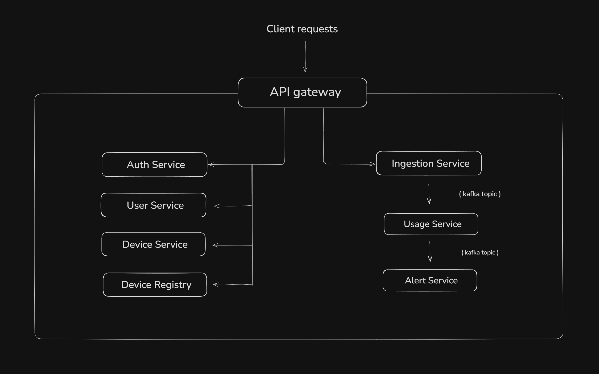

# Ez-Home IoT platform

Scalable IoT backend built with Java Spring boot that monitors household devices energy consumption by ingesting real-time telemetry, computing usage statistics, and generating user-defined alerts

>This is an ongoing project, README reflects the current state of repo structure, architecture and implemented features

# Architecture Overview

The platform follows a hybrid architecture, combining synchronous REST/gRPC communication with asynchronous event-driven processing through Apache Kafka
- Uses gRPC for efficient internal service-to-service communication
- Kafka decouples services and enables scalable asynchronous processing for telemetry
- Redis caching to eliminate hot-path database lookups
- PostgreSQL persistence with usage aggregation and historical analytics
- Docker Compose setup for easy deployment of complete system

# API Gateway

It serves as the single entry point to the system, routing client requests to the appropriate microservices

- Authenticates incoming requests by verifying JWT token
- Parses claims from token and attaches them to request headers for downstream services

# Auth Service

Manages user signup, login and issues JWT tokens for secure access across the platform

- Handles user registration and login requests
- Registers new user and creates `User` account in `user-service` used by the rest of the platform
- Implements stateless authentication allowing services to validate tokens without maintaining sessions

# User Service

Maintains user profile information independently of authentication

- Authentication and account lifecycle are managed by `auth-service`
- Stores user profile information including email, username, city, profile image, and other preferences
- Serves as the authoritative source of user data for the platform

# Device Service

Manages devices linked to users and acts as the source of truth for user-owned devices

- provides CRUD operations for device registration
 #### Uses gRPC to:
- Verify a device with `device-registry` before registration
- Support user-device `ownership validation` request from other services
- Clean up stale user created alerts in `alert-service` when a device is removed
- Stream `registered device IDs` to other services that need a full device list for background processing

# Device-Registry Service

Maintains the master registry of all approved devices that can be linked inside the platform

- Stores `master record` for devices using identifiers like device ID, batch, model and factory location
- Lets authorized `admins` add, view and remove device entries from the registry
- Uses gRPC to support `device validation` requests from other services

# Ingestion Service

Serves as the entry point and validation gateway for user devices sending telemetry data

- Validates the device ID for every incoming telemetry request
- Uses `Redis` as a fast in-memory store for valid device IDs
- Preloads and refreshes the Redis cache from `device-service` via gRPC during startup
- Publishes valid payloads to a `Kafka event` for other services to consume and process

# Usage Service

Processes validated telemetry to compute and maintain device usage statistics

- Consumes validated telemetry events from Kafka
- Persists `raw telemetry` data for historical analysis and auditing
- Maintains aggregated `daily usage` records for efficient analytics and reporting
- Publishes processed usage statistics to Kafka for downstream services

# Alert Service

Evaluates device usage data against configured alert thresholds and generates notifications

- Consumes processed usage statistics from Kafka
- Maintains alert configs for registered devices in database
- Uses Redis to `cache active alerts` to reduce database lookups during processing
- Evaluates usage data against alerts thresholds in real time and generates notifications

